# World Chess Championship Database Schema Design

## 1. Overview & Architectural Rationale

This schema powers the **World Chess Championship Matchup & Editorial Game System** in **VON.CHESS**. 
Instead of limiting World Championship matchups to simple summary cards or third-party modal redirects, this schema provides a normalized, high-performance foundation for:

1. **Championship Match Overview**: Historical duels, champion/challenger metadata, scores, format, locations, and linked studies.
2. **Featured Match Games**: Complete game records with full PGN notation, opening ECO classification, move metrics, and starting FENs.
3. **Editorial Narrative Sections**: Two-column interactive storytelling (matching the Opera Game layout reference) where long-form prose and section headings (*"Grabbing the center"*, *"Development over material"*) link directly to game plies (`start_ply`, `end_ply`).

---

## 2. Entity Relationship (ER) Diagram

```mermaid
erDiagram
    WORLD_CHAMPIONSHIP_MATCHES ||--o{ WORLD_CHAMPIONSHIP_GAMES : "contains"
    WORLD_CHAMPIONSHIP_GAMES ||--o{ WORLD_CHAMPIONSHIP_GAME_SECTIONS : "breaks down into"
    STUDIES ||--o| WORLD_CHAMPIONSHIP_MATCHES : "optional interactive study"

    WORLD_CHAMPIONSHIP_MATCHES {
        bigint id PK
        string slug UK
        smallint year
        string display_year
        string title
        string champion
        string challenger
        string winner
        string score
        string format
        string location
        string era
        text description
        json key_highlights
        int games_count
        bigint study_id FK
        boolean is_published
        int view_count
        timestamp created_at
        timestamp updated_at
    }

    WORLD_CHAMPIONSHIP_GAMES {
        bigint id PK
        bigint match_id FK
        smallint game_number
        string slug UK
        string title
        string subtitle
        string white_player
        string black_player
        string result
        date game_date
        string eco
        string opening_name
        longtext pgn
        string initial_fen
        smallint total_plies
        text narrative_overview
        boolean is_highlighted
        int order
        timestamp created_at
        timestamp updated_at
    }

    WORLD_CHAMPIONSHIP_GAME_SECTIONS {
        bigint id PK
        bigint game_id FK
        string title
        longtext content
        smallint start_ply
        smallint end_ply
        string key_move_san
        int order
        timestamp created_at
        timestamp updated_at
    }
```



---

## 3. Detailed Table Specifications

### 3.1. `world_championship_matches`
Stores high-level championship duel information.

| Column | Type | Nullable | Default | Description |
| :--- | :--- | :--- | :--- | :--- |
| `id` | `BIGINT UNSIGNED` | No | Auto | Primary Key |
| `slug` | `VARCHAR(100)` | No | - | Unique URL slug (e.g., `wcc-2024`, `wcc-1972`, `opera-game`) |
| `year` | `SMALLINT UNSIGNED` | No | - | Year match took place (indexed for range filters) |
| `display_year` | `VARCHAR(50)` | Yes | `NULL` | Custom display label (e.g. `1993 (PCA)`, `1993 (FIDE)`) |
| `title` | `VARCHAR(255)` | No | - | Official match title |
| `champion` | `VARCHAR(150)` | No | - | Defending champion name |
| `challenger` | `VARCHAR(150)` | No | - | Official challenger name |
| `winner` | `VARCHAR(150)` | No | - | Victorious player |
| `score` | `VARCHAR(50)` | No | - | Final match score (e.g. `7.5 - 6.5`) |
| `format` | `VARCHAR(150)` | No | - | Match structure (e.g. `14 Classical Games + Rapid Tiebreaks`) |
| `location` | `VARCHAR(255)` | No | - | Host city and country venue |
| `era` | `VARCHAR(100)` | No | - | Era classification (Modern, Split, Soviet FIDE, Early Classical) |
| `description` | `TEXT` | No | - | Comprehensive historical duel summary |
| `key_highlights` | `JSON` | Yes | `NULL` | Array of milestone bullet points |
| `games_count` | `INT UNSIGNED` | No | `0` | Number of recorded games |
| `study_id` | `BIGINT UNSIGNED` | Yes | `NULL` | Foreign key referencing interactive study in `studies` |
| `is_published` | `BOOLEAN` | No | `TRUE` | Publication visibility flag |
| `view_count` | `INT UNSIGNED` | No | `0` | Analytics counter |
| `created_at` | `TIMESTAMP` | Yes | `NULL` | Creation timestamp |
| `updated_at` | `TIMESTAMP` | Yes | `NULL` | Last updated timestamp |

**Indexes**:
- `PRIMARY (id)`
- `UNIQUE (slug)`
- `INDEX (year, is_published)`
- `INDEX (era, is_published)`
- `INDEX (study_id)`

---

### 3.2. `world_championship_games`
Stores individual games played within each championship.

| Column | Type | Nullable | Default | Description |
| :--- | :--- | :--- | :--- | :--- |
| `id` | `BIGINT UNSIGNED` | No | Auto | Primary Key |
| `match_id` | `BIGINT UNSIGNED` | No | - | Foreign Key -> `world_championship_matches.id` (CASCADE) |
| `game_number` | `SMALLINT UNSIGNED`| No | `1` | Round or game number |
| `slug` | `VARCHAR(120)` | Yes | `NULL` | Unique game slug (e.g. `wcc-2024-g14`) |
| `title` | `VARCHAR(255)` | No | - | Game title (e.g. `Game 14: The Crowning Moment`) |
| `subtitle` | `VARCHAR(255)` | Yes | `NULL` | Editorial subhead (`Ding Liren vs. Gukesh – Singapore, 2024`) |
| `white_player` | `VARCHAR(150)` | No | - | Player with White pieces |
| `black_player` | `VARCHAR(150)` | No | - | Player with Black pieces |
| `result` | `VARCHAR(10)` | No | - | `1-0`, `0-1`, `1/2-1/2`, or `*` |
| `game_date` | `DATE` | Yes | `NULL` | Date of the game |
| `eco` | `VARCHAR(10)` | Yes | `NULL` | Opening ECO code (e.g. `D37`, `C41`) |
| `opening_name` | `VARCHAR(150)` | Yes | `NULL` | Opening name (e.g. `Queen's Gambit Declined`) |
| `pgn` | `LONGTEXT` | No | - | Full standard PGN string including metadata tags |
| `initial_fen` | `VARCHAR(100)` | No | Starting pos | Starting position FEN string |
| `total_plies` | `SMALLINT UNSIGNED`| No | `0` | Total half-moves count (e.g. 33, 80) |
| `narrative_overview`| `TEXT` | Yes | `NULL` | Opening prose setting the atmosphere |
| `is_highlighted` | `BOOLEAN` | No | `FALSE` | Featured/highlight game flag |
| `order` | `INT` | No | `0` | Sort order |
| `created_at` | `TIMESTAMP` | Yes | `NULL` | Creation timestamp |
| `updated_at` | `TIMESTAMP` | Yes | `NULL` | Last updated timestamp |

**Indexes**:
- `PRIMARY (id)`
- `UNIQUE (slug)`
- `INDEX (match_id, game_number)`
- `INDEX (match_id, is_highlighted)`

---

### 3.3. `world_championship_game_sections`
Stores the editorial story chapters and annotated move blocks matching the two-column editorial design.

| Column | Type | Nullable | Default | Description |
| :--- | :--- | :--- | :--- | :--- |
| `id` | `BIGINT UNSIGNED` | No | Auto | Primary Key |
| `game_id` | `BIGINT UNSIGNED` | No | - | Foreign Key -> `world_championship_games.id` (CASCADE) |
| `title` | `VARCHAR(255)` | No | - | Section heading (e.g. `Grabbing the center`) |
| `content` | `LONGTEXT` | No | - | Editorial markdown prose with bold moves |
| `start_ply` | `SMALLINT UNSIGNED`| Yes | `NULL` | Initial move ply for this section |
| `end_ply` | `SMALLINT UNSIGNED`| Yes | `NULL` | Concluding move ply for this section |
| `key_move_san`| `VARCHAR(20)` | Yes | `NULL` | Highlight move (e.g. `10. Nxb5!`, `50. Qh6+!!`) |
| `order` | `INT` | No | `1` | Section order index |
| `created_at` | `TIMESTAMP` | Yes | `NULL` | Creation timestamp |
| `updated_at` | `TIMESTAMP` | Yes | `NULL` | Last updated timestamp |

**Indexes**:
- `PRIMARY (id)`
- `INDEX (game_id, order)`

---

## 4. Pure SQL / DDL Schema

```sql
-- 1. Matches Table
CREATE TABLE IF NOT EXISTS world_championship_matches (
    id BIGINT UNSIGNED AUTO_INCREMENT PRIMARY KEY,
    slug VARCHAR(100) NOT NULL UNIQUE,
    year SMALLINT UNSIGNED NOT NULL,
    display_year VARCHAR(50) NULL,
    title VARCHAR(255) NOT NULL,
    champion VARCHAR(150) NOT NULL,
    challenger VARCHAR(150) NOT NULL,
    winner VARCHAR(150) NOT NULL,
    score VARCHAR(50) NOT NULL,
    format VARCHAR(150) NOT NULL,
    location VARCHAR(255) NOT NULL,
    era VARCHAR(100) NOT NULL,
    description TEXT NOT NULL,
    key_highlights JSON NULL,
    games_count INT UNSIGNED DEFAULT 0,
    study_id BIGINT UNSIGNED NULL,
    is_published BOOLEAN DEFAULT TRUE,
    view_count INT UNSIGNED DEFAULT 0,
    created_at TIMESTAMP NULL DEFAULT CURRENT_TIMESTAMP,
    updated_at TIMESTAMP NULL DEFAULT CURRENT_TIMESTAMP ON UPDATE CURRENT_TIMESTAMP,
    INDEX idx_wcc_year_published (year, is_published),
    INDEX idx_wcc_era_published (era, is_published)
) ENGINE=InnoDB DEFAULT CHARSET=utf8mb4 COLLATE=utf8mb4_unicode_ci;

-- 2. Games Table
CREATE TABLE IF NOT EXISTS world_championship_games (
    id BIGINT UNSIGNED AUTO_INCREMENT PRIMARY KEY,
    match_id BIGINT UNSIGNED NOT NULL,
    game_number SMALLINT UNSIGNED DEFAULT 1,
    slug VARCHAR(120) NULL UNIQUE,
    title VARCHAR(255) NOT NULL,
    subtitle VARCHAR(255) NULL,
    white_player VARCHAR(150) NOT NULL,
    black_player VARCHAR(150) NOT NULL,
    result VARCHAR(10) NOT NULL,
    game_date DATE NULL,
    eco VARCHAR(10) NULL,
    opening_name VARCHAR(150) NULL,
    pgn LONGTEXT NOT NULL,
    initial_fen VARCHAR(100) DEFAULT 'rnbqkbnr/pppppppp/8/8/8/8/PPPPPPPP/RNBQKBNR w KQkq - 0 1',
    total_plies SMALLINT UNSIGNED DEFAULT 0,
    narrative_overview TEXT NULL,
    is_highlighted BOOLEAN DEFAULT FALSE,
    `order` INT DEFAULT 0,
    created_at TIMESTAMP NULL DEFAULT CURRENT_TIMESTAMP,
    updated_at TIMESTAMP NULL DEFAULT CURRENT_TIMESTAMP ON UPDATE CURRENT_TIMESTAMP,
    CONSTRAINT fk_wcc_games_match FOREIGN KEY (match_id)
        REFERENCES world_championship_matches (id) ON DELETE CASCADE,
    INDEX idx_wcc_games_match_number (match_id, game_number),
    INDEX idx_wcc_games_highlight (match_id, is_highlighted)
) ENGINE=InnoDB DEFAULT CHARSET=utf8mb4 COLLATE=utf8mb4_unicode_ci;

-- 3. Narrative Sections Table
CREATE TABLE IF NOT EXISTS world_championship_game_sections (
    id BIGINT UNSIGNED AUTO_INCREMENT PRIMARY KEY,
    game_id BIGINT UNSIGNED NOT NULL,
    title VARCHAR(255) NOT NULL,
    content LONGTEXT NOT NULL,
    start_ply SMALLINT UNSIGNED NULL,
    end_ply SMALLINT UNSIGNED NULL,
    key_move_san VARCHAR(20) NULL,
    `order` INT DEFAULT 1,
    created_at TIMESTAMP NULL DEFAULT CURRENT_TIMESTAMP,
    updated_at TIMESTAMP NULL DEFAULT CURRENT_TIMESTAMP ON UPDATE CURRENT_TIMESTAMP,
    CONSTRAINT fk_wcc_sections_game FOREIGN KEY (game_id)
        REFERENCES world_championship_games (id) ON DELETE CASCADE,
    INDEX idx_wcc_sections_game_order (game_id, `order`)
) ENGINE=InnoDB DEFAULT CHARSET=utf8mb4 COLLATE=utf8mb4_unicode_ci;
```
