# World Chess Championship Database Schema Design

## 1. Overview & Architectural Rationale

This schema powers the **World Chess Championship Matchup & Editorial Game System** in **VON.CHESS**. 
Instead of limiting World Championship matchups to simple summary cards or third-party modal redirects, this schema provides a normalized, high-performance foundation for:

1. **Championship Match Overview**: Historical duels, champion/challenger metadata, scores, format, locations, and linked studies.
2. **Featured Match Games**: Complete game records with full PGN notation, opening ECO classification, move metrics, and starting FENs.
3. **Editorial Narrative Sections**: Two-column interactive storytelling (matching the Opera Game layout reference) where long-form prose and section headings (*"Grabbing the center"*, *"Development over material"*) link directly to game plies (`start_ply`, `end_ply`).

---

## 2. Entity Relationship (ER) Diagram

```mermaid
erDiagram
    WORLD_CHAMPIONSHIP_MATCHES ||--o{ WORLD_CHAMPIONSHIP_GAMES : "contains"
    WORLD_CHAMPIONSHIP_GAMES ||--o{ WORLD_CHAMPIONSHIP_GAME_SECTIONS : "breaks down into"
    STUDIES ||--o| WORLD_CHAMPIONSHIP_MATCHES : "optional interactive study"

    WORLD_CHAMPIONSHIP_MATCHES {
        bigint id PK
        string slug UK
        smallint year
        string display_year
        string title
        string champion
        string challenger
        string winner
        string score
        string format
        string location
        string era
        text description
        json key_highlights
        int games_count
        bigint study_id FK
        boolean is_published
        int view_count
        timestamp created_at
        timestamp updated_at
    }

    WORLD_CHAMPIONSHIP_GAMES {
        bigint id PK
        bigint match_id FK
        smallint game_number
        string slug UK
        string title
        string subtitle
        string white_player
        string black_player
        string result
        date game_date
        string eco
        string opening_name
        longtext pgn
        string initial_fen
        smallint total_plies
        text narrative_overview
        boolean is_highlighted
        int order
        timestamp created_at
        timestamp updated_at
    }

    WORLD_CHAMPIONSHIP_GAME_SECTIONS {
        bigint id PK
        bigint game_id FK
        string title
        longtext content
        smallint start_ply
        smallint end_ply
        string key_move_san
        int order
        timestamp created_at
        timestamp updated_at
    }
```



---

## 3. Detailed Table Specifications

### 3.1. `world_championship_matches`
Stores high-level championship duel information.

| Column | Type | Nullable | Default | Description |
| :--- | :--- | :--- | :--- | :--- |
| `id` | `BIGINT UNSIGNED` | No | Auto | Primary Key |
| `slug` | `VARCHAR(100)` | No | - | Unique URL slug (e.g., `wcc-2024`, `wcc-1972`) |
| `year` | `SMALLINT UNSIGNED` | No | - | Year match took place (indexed for range filters) |
| `display_year` | `VARCHAR(50)` | Yes | `NULL` | Custom display label (e.g. `1993 (PCA)`, `1993 (FIDE)`) |
| `title` | `VARCHAR(255)` | No | - | Official match title |
| `champion` | `VARCHAR(150)` | No | `'Defender'` | Defending champion name |
| `challenger` | `VARCHAR(150)` | No | `'Challenger'` | Official challenger name |
| `winner` | `VARCHAR(150)` | Yes | `NULL` | Victorious player |
| `score` | `VARCHAR(50)` | Yes | `'0 - 0'` | Final match score (e.g. `7.5 - 6.5`) |
| `format` | `VARCHAR(150)` | Yes | `NULL` | Match structure (e.g. `14 Classical Games + Rapid Tiebreaks`) |
| `location` | `VARCHAR(255)` | Yes | `NULL` | Host city and country venue |
| `era` | `VARCHAR(100)` | Yes | `'Modern Era (2006-Present)'` | Era classification |
| `description` | `TEXT` | Yes | `NULL` | Historical duel summary |
| `key_highlights` | `JSON` | Yes | `NULL` | Array of milestone bullet points |
| `games_count` | `INT UNSIGNED` | No | `0` | Number of recorded games |
| `study_id` | `BIGINT UNSIGNED` | Yes | `NULL` | Foreign key referencing interactive study in `studies` |
| `is_published` | `BOOLEAN` | No | `TRUE` | Publication visibility flag |
| `view_count` | `INT UNSIGNED` | No | `0` | Analytics counter |
| `created_at` | `TIMESTAMP` | Yes | `NULL` | Creation timestamp |
| `updated_at` | `TIMESTAMP` | Yes | `NULL` | Last updated timestamp |

**Indexes**:
- `PRIMARY (id)`
- `UNIQUE (slug)`
- `INDEX (year, is_published)`
- `INDEX (era, is_published)`
- `INDEX (study_id)`

---

### 3.2. `world_championship_games`
Stores individual games played within each championship.

| Column | Type | Nullable | Default | Description |
| :--- | :--- | :--- | :--- | :--- |
| `id` | `BIGINT UNSIGNED` | No | Auto | Primary Key |
| `match_id` | `BIGINT UNSIGNED` | No | - | Foreign Key -> `world_championship_matches.id` (CASCADE) |
| `game_number` | `SMALLINT UNSIGNED`| No | `1` | Round or game number |
| `slug` | `VARCHAR(120)` | Yes | `NULL` | Unique game slug (e.g. `wcc-2024-g14`) |
| `title` | `VARCHAR(255)` | No | - | Game title (e.g. `Game 14: The Crowning Moment`) |
| `subtitle` | `VARCHAR(255)` | Yes | `NULL` | Editorial subhead (`Ding Liren vs. Gukesh – Singapore, 2024`) |
| `white_player` | `VARCHAR(150)` | Yes | `NULL` | Player with White pieces (auto-extracted from PGN) |
| `black_player` | `VARCHAR(150)` | Yes | `NULL` | Player with Black pieces (auto-extracted from PGN) |
| `result` | `VARCHAR(10)` | Yes | `'*'` | `1-0`, `0-1`, `1/2-1/2`, or `*` (auto-extracted from PGN) |
| `game_date` | `DATE` | Yes | `NULL` | Date of the game |
| `eco` | `VARCHAR(10)` | Yes | `NULL` | ECO opening code (e.g. `D37`) |
| `opening_name` | `VARCHAR(150)` | Yes | `NULL` | Opening name |
| `pgn` | `LONGTEXT` | Yes | `NULL` | Complete PGN moves & tags |
| `initial_fen` | `VARCHAR(100)` | Yes | Default FEN | Starting board position |
| `total_plies` | `SMALLINT UNSIGNED`| No | `0` | Number of half-moves |
| `narrative_overview` | `TEXT` | Yes | `NULL` | Editorial narrative overview |
| `is_highlighted` | `BOOLEAN` | No | `FALSE` | Key game feature flag |
| `order` | `INT` | No | `0` | Display order |
| `created_at` | `TIMESTAMP` | Yes | `NULL` | Creation timestamp |
| `updated_at` | `TIMESTAMP` | Yes | `NULL` | Last updated timestamp |

**Indexes**:
- `PRIMARY (id)`
- `INDEX (match_id, game_number)`
- `INDEX (match_id, is_highlighted)`

---

### 3.3. `world_championship_game_sections`
Stores narrative story sections linked to specific game moves.

| Column | Type | Nullable | Default | Description |
| :--- | :--- | :--- | :--- | :--- |
| `id` | `BIGINT UNSIGNED` | No | Auto | Primary Key |
| `game_id` | `BIGINT UNSIGNED` | No | - | Foreign Key -> `world_championship_games.id` (CASCADE) |
| `title` | `VARCHAR(255)` | No | - | Section headline (e.g. `Opening Phase`, `Tactical Turning Point`) |
| `content` | `LONGTEXT` | No | - | Narrative prose with embedded moves |
| `start_ply` | `SMALLINT UNSIGNED`| Yes | `NULL` | Starting ply index on board |
| `end_ply` | `SMALLINT UNSIGNED`| Yes | `NULL` | Ending ply index on board |
| `key_move_san` | `VARCHAR(20)` | Yes | `NULL` | Critical highlighted move SAN |
| `order` | `INT` | No | `1` | Sequential order |
| `created_at` | `TIMESTAMP` | Yes | `NULL` | Creation timestamp |
| `updated_at` | `TIMESTAMP` | Yes | `NULL` | Last updated timestamp |

**Indexes**:
- `PRIMARY (id)`
- `INDEX (game_id, order)`

---

## 4. DDL Definition

```sql
-- 1. Matches Table
CREATE TABLE IF NOT EXISTS world_championship_matches (
    id BIGINT UNSIGNED AUTO_INCREMENT PRIMARY KEY,
    slug VARCHAR(100) NOT NULL UNIQUE,
    year SMALLINT UNSIGNED NOT NULL,
    display_year VARCHAR(50) NULL,
    title VARCHAR(255) NOT NULL,
    champion VARCHAR(150) NOT NULL DEFAULT 'Defender',
    challenger VARCHAR(150) NOT NULL DEFAULT 'Challenger',
    winner VARCHAR(150) NULL,
    score VARCHAR(50) NULL DEFAULT '0 - 0',
    format VARCHAR(150) NULL,
    location VARCHAR(255) NULL,
    era VARCHAR(100) NULL DEFAULT 'Modern Era (2006-Present)',
    description TEXT NULL,
    key_highlights JSON NULL,
    games_count INT UNSIGNED DEFAULT 0,
    study_id BIGINT UNSIGNED NULL,
    is_published BOOLEAN DEFAULT TRUE,
    view_count INT UNSIGNED DEFAULT 0,
    created_at TIMESTAMP NULL DEFAULT CURRENT_TIMESTAMP,
    updated_at TIMESTAMP NULL DEFAULT CURRENT_TIMESTAMP ON UPDATE CURRENT_TIMESTAMP,
    INDEX idx_wcc_year_published (year, is_published),
    INDEX idx_wcc_era_published (era, is_published)
) ENGINE=InnoDB DEFAULT CHARSET=utf8mb4 COLLATE=utf8mb4_unicode_ci;

-- 2. Games Table
CREATE TABLE IF NOT EXISTS world_championship_games (
    id BIGINT UNSIGNED AUTO_INCREMENT PRIMARY KEY,
    match_id BIGINT UNSIGNED NOT NULL,
    game_number SMALLINT UNSIGNED DEFAULT 1,
    slug VARCHAR(120) NULL UNIQUE,
    title VARCHAR(255) NOT NULL,
    subtitle VARCHAR(255) NULL,
    white_player VARCHAR(150) NULL,
    black_player VARCHAR(150) NULL,
    result VARCHAR(10) NULL DEFAULT '*',
    game_date DATE NULL,
    eco VARCHAR(10) NULL,
    opening_name VARCHAR(150) NULL,
    pgn LONGTEXT NOT NULL,
    initial_fen VARCHAR(100) DEFAULT 'rnbqkbnr/pppppppp/8/8/8/8/PPPPPPPP/RNBQKBNR w KQkq - 0 1',
    total_plies SMALLINT UNSIGNED DEFAULT 0,
    narrative_overview TEXT NULL,
    is_highlighted BOOLEAN DEFAULT FALSE,
    `order` INT DEFAULT 0,
    created_at TIMESTAMP NULL DEFAULT CURRENT_TIMESTAMP,
    updated_at TIMESTAMP NULL DEFAULT CURRENT_TIMESTAMP ON UPDATE CURRENT_TIMESTAMP,
    CONSTRAINT fk_wcc_games_match FOREIGN KEY (match_id)
        REFERENCES world_championship_matches (id) ON DELETE CASCADE,
    INDEX idx_wcc_games_match_number (match_id, game_number),
    INDEX idx_wcc_games_highlight (match_id, is_highlighted)
) ENGINE=InnoDB DEFAULT CHARSET=utf8mb4 COLLATE=utf8mb4_unicode_ci;

-- 3. Narrative Sections Table
CREATE TABLE IF NOT EXISTS world_championship_game_sections (
    id BIGINT UNSIGNED AUTO_INCREMENT PRIMARY KEY,
    game_id BIGINT UNSIGNED NOT NULL,
    title VARCHAR(255) NOT NULL,
    content LONGTEXT NOT NULL,
    start_ply SMALLINT UNSIGNED NULL,
    end_ply SMALLINT UNSIGNED NULL,
    key_move_san VARCHAR(20) NULL,
    `order` INT DEFAULT 1,
    created_at TIMESTAMP NULL DEFAULT CURRENT_TIMESTAMP,
    updated_at TIMESTAMP NULL DEFAULT CURRENT_TIMESTAMP ON UPDATE CURRENT_TIMESTAMP,
    CONSTRAINT fk_wcc_sections_game FOREIGN KEY (game_id)
        REFERENCES world_championship_games (id) ON DELETE CASCADE,
    INDEX idx_wcc_sections_game_order (game_id, `order`)
) ENGINE=InnoDB DEFAULT CHARSET=utf8mb4 COLLATE=utf8mb4_unicode_ci;
```
